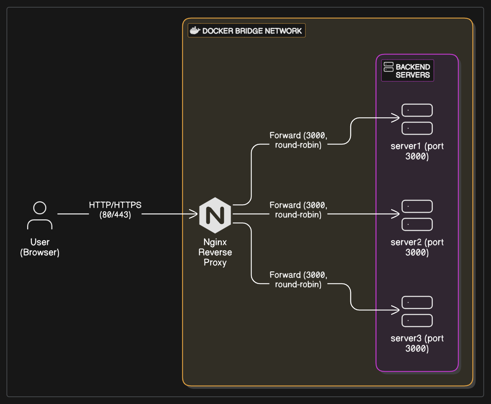
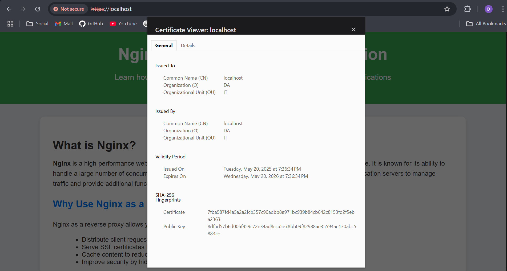

# Load balancing and Reverse Proxy Using Nginx

This project demonstrates how to configure **Nginx as a reverse proxy and load balancer** for multiple backend applications — all containerized using Docker and managed via Docker Compose.

By the end of this setup, Nginx will efficiently route HTTP and HTTPS traffic to different backend services running in isolated containers.

## Architecture


## Setup Instructions

### 1. **Generate SSL Certificates**

Run this **only once**, inside the `nginx/certs/` directory:

```bash
mkdir -p nginx/certs
openssl req -x509 -nodes -days 365 -newkey rsa:2048 \
  -keyout nginx/certs/nginx-selfsigned.key \
  -out nginx/certs/nginx-selfsigned.crt \
  -subj "/C=IN/ST=MH/L=Pune/O=DA/OU=IT/CN=localhost"
```

📌 **Note:** If the certs already exist, skip this step.

---

### 2. **Start All Containers**

```bash
docker compose up -d --build
```

This will:

* Build 3 instances of the backend app (`server1`, `server2`, `server3`)
* Start Nginx as a reverse proxy with HTTPS enabled

---

### 3. **Test Backend Services (Direct Access)**

Verify that each backend is running:

* [http://localhost:3001](http://localhost:3001)
* [http://localhost:3002](http://localhost:3002)
* [http://localhost:3003](http://localhost:3003)

---

### 4. **Access via Nginx Reverse Proxy**

* [http://localhost](http://localhost) (port 80)
* [https://localhost](https://localhost) (port 443) (⚠ self-signed cert)

Nginx will route traffic to the backend containers using round-robin or any configured load-balancing strategy.




## 🛠️ Development Notes

* The `server/` directory is reused to simulate 3 backend services
* Self-signed certs are **for development only**
* Nginx config and certs are mounted into the container via `volumes`

